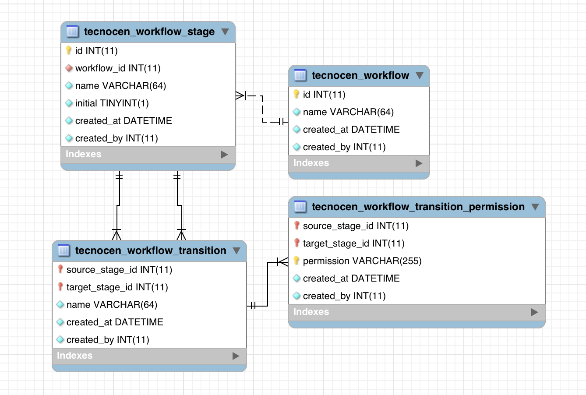

Tecnocen Workflow
=================

Library to dynamically handle workflows in a database.

Instalation
-----------

You can use composer to install the library `tecnocen/yii2-workflow` by running
the command;

`composer require tecnocen/yii2-workflow`

or edit the `composer.json` file

```json
require: {
    "tecnocen/yii2-workflow": "*",
}
```

Then run the required migrations

`php yii migrate/up -p=@vendor/tecnocen/yii2-workflow/src/migrations`

Which will install the following table structure




ROA Backend Usage
-----------------

The ROA support is very simple and can be done by just adding a module version
to the api container which will be used to hold the resources.

```php
class Api extends \tecnocen\roa\modules\ApiContainer
{
   $versions = [
       // other versions
       'w1' => ['class' => 'tecnocen\workflow\roa\modules\Version'],
   ];
}

You can then access the module to check the available resources.

- workflow
- workflow/<workflow_id:\d+>/stage
- workflow/<workflow_id:\d+>/stage/<stage_id:\d+>/transition
- workflow/<workflow_id:\d+>/stage/<stage_id:\d+>/transition/<target_id:\d+>/permission

Which will implement CRUD functionalities for a workflow.

Process and Worklog
-------------------

A `process` is an entity which changes from stage depending on a workflow. Each
stage change is registered on a `worklog` for each `process` record.

To create a `process` its required to create a migrations for the process and
the worklog then the models to handle them, its adviced to use the provided
migration templates.

```php
class m170101_010101_credit extends EntityTable
{
    public function getTableName()
    {
        return 'credit';
    }

    public function columns()
    {
         return [
             'id' => $this->primaryKey(),
             'workflow_id' => $this->normalKey(),
             // other columns
         ];
    }

    public function foreignKeys()
    {
        return [
            'workflow_id' => ['table' => 'tecnocen_workflow'];
        ];
    }
}
```

```php
class m170101_010102_credit_worklog extends \tecnocen\workflow\migrations\WorkLog
{
    public function getProcessTableName()
    {
        return 'credit';
    }
}
```

```php
class CreditWorkLog extends \tecnocen\workflow\models\WorkLog
{
    public static function processClass()
    {
        return Credit::class;
    }
}
```

Worklog Resource
----------------

Each process gets a workflog about the flow of stages it goes through.

On ROA you can declare each worklog as a child resource for the process resource

```php
public $resources = [
   'credit',
   'credit/<credit_id:\d+>/worklog' => [
       'class' => WorklogResource::class,
       'modelClass' => CreditWorklog::class,
   ]
];
```
